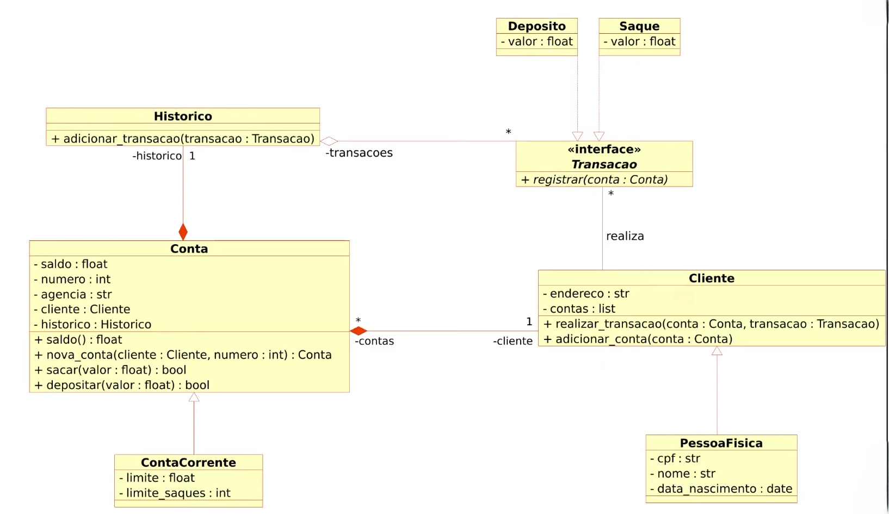

# Sistema Bancário em POO (Python)

Este projeto é uma implementação de um sistema bancário simples em Python, com foco na transição de uma abordagem estrutural (usando dicionários) para uma abordagem completa de Programação Orientada a Objetos (POO).

## 🎯 Objetivo Geral

Iniciar a modelagem de um sistema bancário utilizando Programação Orientada a Objetos (POO). O projeto inicial foca em adicionar classes para `Cliente` e implementar as operações bancárias básicas: `Depósito` e `Saque`.

---

## 🏆 Desafio

O desafio principal deste projeto foi **atualizar a implementação do sistema bancário** para uma arquitetura robusta baseada em objetos. O código foi refatorado para seguir estritamente o modelo de classes UML.

---

## 🏛️ Estrutura de Classes (UML)

O design do sistema segue o Diagrama UML, que define as seguintes classes e seus relacionamentos:



### Classes Implementadas:

- **`Cliente`**: Classe base que gerencia o endereço e a lista de contas de um cliente.
  - `realizar_transacao(conta, transacao)`
  - `adicionar_conta(conta)`
- **`PessoaFisica`**: Herda de `Cliente`, adicionando atributos específicos como `cpf`, `nome` e `data_nascimento`.
- **`Conta`**: Classe base para contas bancárias. Controla `saldo`, `numero`, `agencia`, e associa um `Cliente` e um `Historico`.
  - `sacar(valor)`
  - `depositar(valor)`
  - `nova_conta(cliente, numero)` (Classmethod)
- **`ContaCorrente`**: Herda de `Conta`, implementando regras de negócio específicas, como um **limite de 3 saques** e um **valor limite de R$ 500,00 por saque**.
- **`Historico`**: Classe dedicada a gerenciar e armazenar

---

## 📦 Como rodar localmente

Pré-requisitos

- Python 3.10+ recomendado

1. Clonar o repositório

```bash
git clone https://github.com/<seu-usuario>/<seu-repo>.git
cd <seu-repo>
```

2. Criar e ativar o ambiente virtual

Windows (PowerShell)

```bash
python -m venv .venv
.venv\Scripts\Activate.ps1
```

3. Executar

```bash
python sitema_bancario_POO.py
```

---

### 🧠 Desafio extra (próxima branch)

```
- Após concluir a modelagem das classes e a criação dos métodos
- Atualizar os métodos que tratam as opções do menu, para funcionarem com as classes modeladas.
- Atualizar os métodos que tratam as opções do menu para funcionarem com as classes modeladas (Cliente, Conta, Transacao, etc.)
```

Será feito em outra branch e integrado posteriormente.
